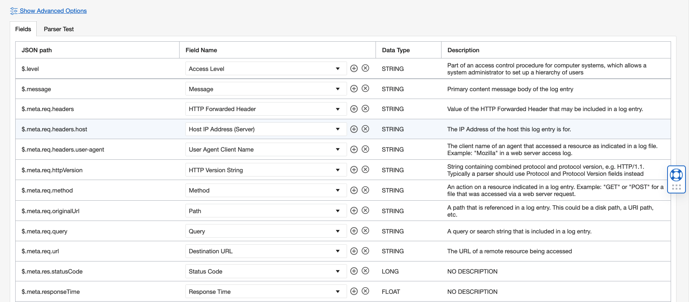
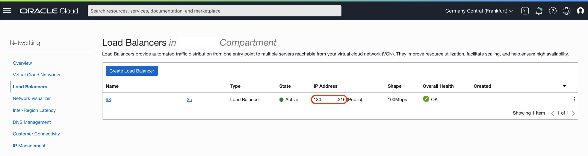

# OCI Kubernetes and Logging Analytics

This project is an OCI Logging Analytics "Hello World" with Kubernetes.

This project is composed of:

- Hello World API app in Node.js (no db connectivity)
- Terraform scripts for Oracle Kubernetes Engine
- Deployment manifest for app with terraform helm_release.

## TODO

- Query the logs in Logging Analytics
- Add policies and Dynamic group

## Enable access to Log Group with Instance Principal

> Requirement: Logging Analytics enabled on the OCI Region ([Quick Start](https://docs.oracle.com/en/cloud/paas/logging-analytics/logqs/)).

Create a Dynamic Group called `dynamic-group-oke-node-pool` that matches OKE node pool workers with matching rule:

```
All {instance.compartment.id = '<compartment_ocid>'
```

> You have to replace `<compartment_ocid>` for the compartment OCID where your Kubernetes Cluster is created.

Create a policy to allow access to Log Group with the following rule:

```
Allow dynamic-group dynamic-group-oke-node-pool to {LOG_ANALYTICS_LOG_GROUP_UPLOAD_LOGS} in compartment <Logging Analytics LogGroup's compartment_name>
```

## Logging Analytics

Go to **Menu** > **Observability & Management** > **Logging Analytics** > **Administration**.

### Create Parser

On the side menu, click **Parsers**.

Click **Create Parser**, then click **JSON Type** and fill the form with the following information:

- Name: `hello-api-parser`
- Description: `Hello API App Parser`
- Example Log Content: `{"level":"http","message":"HTTP GET /hello","meta":{"req":{"headers":{"accept":"*/*","host":"localhost:3000","user-agent":"curl/7.79.1"},"httpVersion":"1.1","method":"GET","originalUrl":"/hello","query":{},"url":"/hello"},"res":{"statusCode":200},"responseTime":0}}`

The Fields should look like this:



Click `Create Parser` to confirm.

### Create Source

On the side menu, click **Sources**.

Click **Create Source** and fill the form with the following information:

- Name: `hello-api-source`
- Description: `Hello API App Source`
- Source Type: `File`
- Entity Types: `OCI Compute Instance`
- Parser: `Specific Parser` and select `hello-api-parser`

Click `Create Source` to confirm.

## Deploy from here

> You need to be administrator, for now. Working on enumerating policies required as an option.
>
> Policies:
>
> - `Allow group group_name to inspect instance-family in tenancy`
> - [Preparing for Container Engine for Kubernetes](https://docs.oracle.com/en-us/iaas/Content/ContEng/Concepts/contengprerequisites.htm#Preparing_for_Container_Engine_for_Kubernetes)
> - [Create Required Policy for Groups for Kubernetes](https://docs.oracle.com/en-us/iaas/Content/ContEng/Concepts/contengpolicyconfig.htm#policyforgroupsrequired)

[](https://cloud.oracle.com/resourcemanager/stacks/create?zipUrl=https://github.com/vmleon/oci-hello-loganalytics/releases/download/v0.1.2/logan.zip)

When successfully deployed you can run some tests and go to Log Analytics to work with the generated logs.

## Manual Test Application

> Requirements
>
> - Terraform installed
> - OCI CLI configured
> - Helm installed
> - Docker/Podman installed

If deployed from your local machine, you can run `export KUBECONFIG=$(pwd)/generated/kubeconfig` from the `provisioning` folder.

With the `KUBECONFIG` exported you can use `kubectl get nodes` to get the Kubernetes worker nodes and list the helm releases with `helm list`.

Get the public IP of the load balancer:

Go to **Menu** > **Networking** > **Load Balancers** > **Administration**.



Get the Public IP from the column:

```
export LB_PUBLIC_IP=<VALUE_FROM_UI>
```

> If you are deploying from your local terminal:
>
> ```
> export LB_PUBLIC_IP=$(kubectl get services -o jsonpath='{.items[?(@.spec.type=="LoadBalancer")].status.loadBalancer.ingress[0].ip}')
> ```

You have two options to generate some workload and therefore logs to be explored with Logging Analytics.

- Option 1: `podman run -i grafana/k6 run -e LB_PUBLIC_IP=$LB_PUBLIC_IP - <load/test.js`
- Option 2: Run a bunch of `curl -s http://$LB_PUBLIC_IP/hello`.

## Destroy

Before destroy you need to purge logs.

With Web Console:
Go to **Menu** > **Observability & Management** > **Logging Analytics** > **Administration**.
Go on the side menu to **Storage**.
Click the red button **Purge Logs**.
Select your Log Group Compartment.
Click **Purge**.

> Wit the OCI CLI (Terminal):
>
> ```
> oci log-analytics storage purge-storage-data \
>     -c $COMPARTMENT \
>     --namespace-name $(oci os ns get --query 'data' | tr -d '\"') \
>     --time-data-ended $(date -u +%FT%TZ)
> ```

Go to **Menu** > **Developer Services** > **Resource Manager** > **Stacks**.

Click on your stack.

Open **Show Advanced Options** and disable **Refresh Resource States Before Checking For Differences**.

Then confirm by clicking on `Destroy`.

Finally run:

> FIXME: refresh false because error with `helm_release`

```
terraform destroy --refresh=false
```

## Build the app (optional)

> You can use the following image publicly available `fra.ocir.io/fruktknlrefu/hello-api:latest` or build your own image. Jump to next section if you are reusing the public image.

Build the image yourself:

Inside folder `api` run the `podman build -t hello-api .`

Tag the image `podman tag hello-api:latest fra.ocir.io/TENANCY_NAMESPACE/hello-api:latest`. Change the URL for the region you are working, `fra`, `lhr`, etc.

Login the image registry with `podman login fra.ocir.io`. User is `TENANCY_NAMESPACE/YOUR_EMAIL` and the password is the Auth Token you can create for your user.

Push the image `podman push fra.ocir.io/TENANCY_NAMESPACE/hello-api:latest`.
