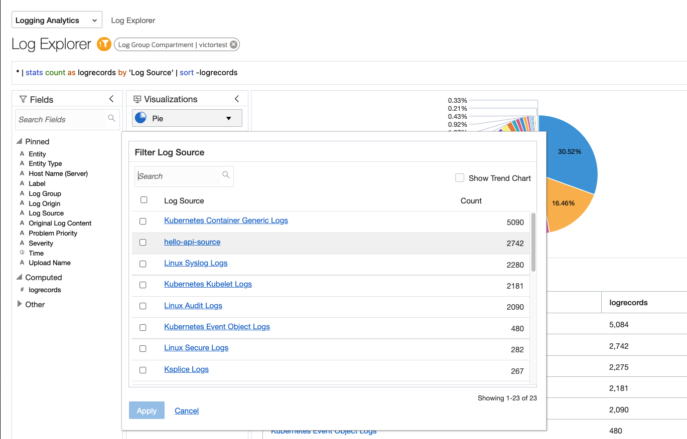
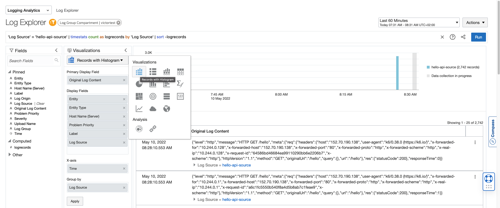

# OCI Kubernetes and Logging Analytics

This project is an OCI Logging Analytics "Hello World" with OCI Kubernetes.

This project is composed of:

- Hello World API app in Node.js (no db connectivity yet)
- Terraform scripts for Oracle Kubernetes Engine
- Deployment manifest for app with terraform helm_release.

> **Work in Progress**
> - OCI Logging Analytics on-boarding within the terraform script.

## Enable access to Log Group with Instance Principal

> Requirement: Logging Analytics enabled on the OCI Region ([Quick Start](https://docs.oracle.com/en/cloud/paas/logging-analytics/logqs/)).

Create a Dynamic Group called `dynamic-group-oke-node-pool` that matches OKE node pool workers with matching rule:

```
All {instance.compartment = '<COMPARTMENT_NAME>'}
```

> You have to replace `<COMPARTMENT_NAME>` for the compartment name where your Kubernetes Cluster is going to be created.

Create a policy to allow access to Log Group with the following rule:

```
Allow dynamic-group dynamic-group-oke-node-pool to {LOG_ANALYTICS_LOG_GROUP_UPLOAD_LOGS} in compartment <COMPARTMENT_NAME>
```

## Logging Analytics

Go to **Menu** > **Observability & Management** > **Logging Analytics** > **Administration**.

### Create Source

On the side menu, click **Sources**.

Click **Create Source** and fill the form with the following information:

- Name: `hello-api-source`
- Description: `Hello API App Source`
- Source Type: `File`
- Entity Types: `OCI Compute Instance`
- Parser: `Automatically parse time only`

Click `Create Source` to confirm.

<!--

## Deploy from here

> You need to be administrator, for now. Working on enumerating policies required as an option.
>
> Policies:
>
> - `Allow group group_name to inspect instance-family in tenancy`
> - [Preparing for Container Engine for Kubernetes](https://docs.oracle.com/en-us/iaas/Content/ContEng/Concepts/contengprerequisites.htm#Preparing_for_Container_Engine_for_Kubernetes)
> - [Create Required Policy for Groups for Kubernetes](https://docs.oracle.com/en-us/iaas/Content/ContEng/Concepts/contengpolicyconfig.htm#policyforgroupsrequired)

[](https://cloud.oracle.com/resourcemanager/stacks/create?zipUrl=https://github.com/vmleon/oci-hello-loganalytics/releases/download/v0.1.4/logan.zip)

Review and Check the Terms. The web form will populate automatically.

Click **Next**.

On the next screen, make sure you select the compartment where you want to deploy the stack.

Click **Next**.

On the final screen, review the information and make sure **Run Apply** is checked.

Click **Create**.

When successfully deployed you can run some tests and go to Log Analytics to work with the generated logs.
-->

## Deploy

Go to OCI Web Console and open Cloud Shell.


Clone this repository with:

```
git clone https://github.com/vmleon/oci-hello-loganalytics.git
```

Change directory to `oci-hello-loganalytics/provisioning`:

```
cd oci-hello-loganalytics/provisioning
```

Terraform initizate:

```
terraform init
```

Before we apply the infrastructure with terraform, we need to set some variables.

Let's start with copy the template variable file:

```
cp terraform.tfvars_template terraform.tfvars
```

Get the values and copy them aside from running these commands

Region:

```
echo $OCI_REGION
```

Tenancy:

```
echo $OCI_TENANCY
```

> If using the root compartment (trials) for `compartment_ocid` set the `OCI_TENANCY` value as well, otherwise, use the specific OCID compartment:
> 
> Do you want to search for a specific compartment by name? Use the following command and replace `<COMPARTMENT_NAME>` by the name of the compartment.
> ```
> oci iam compartment list \
>   --all \
>   --compartment-id-in-subtree true \
>   --query 'data[0].id' \
>   --name <COMPARTMENT_NAME>
> ```

Edit the file with `vim`:

> NOTE: You can leave empty the `profile` property

```
vim terraform.tfvars
```

An example of the final result would be:

```
region = "eu-frankfurt-1"
tenancy_ocid = "ocid1.tenancy.oc1..aaa............."
compartment_ocid = "ocid1.compartment.oc1..aaa.............""
profile = ""
```

Run the Terraform apply:

```
terraform apply -auto-approve
```

After 10 to 20 minutes the resources should be created.

You will see something like this:

```
Apply complete! Resources: 19 added, 0 changed, 0 destroyed.

Outputs:

deployed_oke_kubernetes_version = "v1.22.5"
generated_private_key_pem = <sensitive>
kubeconfig_for_kubectl = "export KUBECONFIG=$(pwd)/generated/kubeconfig"
```

Run that last command:

```
export KUBECONFIG=$(pwd)/generated/kubeconfig
```

## Manual Application Testing

With the `KUBECONFIG` exported you can use `kubectl get nodes` to get the Kubernetes worker nodes.

You can also list the helm app installed with:

```
helm list
```

Make sure the application `hello-api` is successfully deployed.

Get the public IP of the load balancer into the variable `LB_PUBLIC_IP`:

```
export LB_PUBLIC_IP=$(kubectl get services -o jsonpath='{.items[?(@.spec.type=="LoadBalancer")].status.loadBalancer.ingress[0].ip}')
```

Print the IP, it should return a valid public IP address.

```
echo $LB_PUBLIC_IP
```

You are going to generate some workload and therefore logs to be explored with Logging Analytics. We are using a tool called [k6.oi](https://k6.io/) run in a container locally.

```
docker run -i grafana/k6 run -e LB_PUBLIC_IP=$LB_PUBLIC_IP - <../load/test.js
```

Finally, generate an error with this `curl` command on an endpoint that doesn't exist.

```
curl -s http://$LB_PUBLIC_IP/nofound
```

## Search your Logs

Go to **Menu** > **Observability & Management** > **Logging Analytics** > **Log Explorer**.

On the filter menu on the left, click on **Log source** and select `hello-api-source`.



Select Records and Histograms as visualization.



Try out this query in Log Explorer

```
'404' and 'Log Source' = 'hello-api-source' | timestats count as logrecords by 'Log Source' | sort -logrecords
```

You will see the log errors `404` you generated with the `/notfound` path.

## Destroy

Before destroy you need to purge logs.

With Web Console:
Go to **Menu** > **Observability & Management** > **Logging Analytics** > **Administration**.
Go on the side menu to **Storage**.
Click the red button **Purge Logs**.
Select your Log Group Compartment.
Click **Purge**.

> Wit the OCI CLI (Terminal):
>
> ```
> oci log-analytics storage purge-storage-data \
>     --namespace-name $(oci os ns get --query 'data' | tr -d '\"') \
>     --time-data-ended $(date -u +%FT%TZ) \
>     -c $COMPARTMENT
> ```

Go to **Menu** > **Developer Services** > **Resource Manager** > **Stacks**.

Click on your stack.

Open **Show Advanced Options** and disable **Refresh Resource States Before Checking For Differences**.

Then confirm by clicking on `Destroy`.

Finally run:

> FIXME: refresh false because error with `helm_release`

```
terraform destroy --refresh=false -auto-approve
```

After few minutes you will see that the resources has been destroy.

<!--
## Build the app (optional)

> You can use the following image publicly available `fra.ocir.io/fruktknlrefu/hello-api:latest` or build your own image. Jump to next section if you are reusing the public image.

Build the image yourself:

Inside folder `api` run the `podman build -t hello-api .`

Tag the image `podman tag hello-api:latest fra.ocir.io/TENANCY_NAMESPACE/hello-api:latest`. Change the URL for the region you are working, `fra`, `lhr`, etc.

Login the image registry with `podman login fra.ocir.io`. User is `TENANCY_NAMESPACE/YOUR_EMAIL` and the password is the Auth Token you can create for your user.

Push the image `podman push fra.ocir.io/TENANCY_NAMESPACE/hello-api:latest`.
-->
