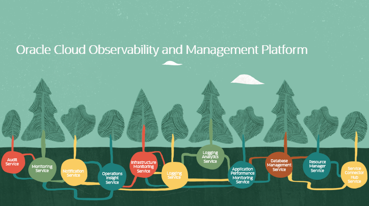

# Introduction

## About this Workshop

This workshop will walk you through the process to deploy and configure an end-to-end monitoring solution for Oracle Container Engine for Kubernetes (OKE) using Logging Analytics, Monitoring and other Oracle Cloud Infrastructure (OCI) Services.
This solutions offers collection of various logs of a Kubernetes cluster into OCI Logging Analytics and offer rich analytics on top of the collected logs. Users may choose to customise the log collection by modifying the out of the box configuration that it provides.

OKE or Kubernetes comes up with some built-in services where each one has different responsibilities and they run on one or more nodes in the cluster either as Deployments or DaemonSets. 
"Kubernetes objects are persistent entities in the Kubernetes system. Kubernetes uses these entities to represent the state of your cluster. Specifically, they can describe:

- What containerized applications are running (and on which nodes)
- The resources available to those applications
- The policies around how those applications behave, such as restart policies, upgrades, and fault-tolerance"

Estimated Workshop Time: X minutes

### Objectives

In this workshop, you will learn how to:

### Prerequisites

-  This workshop requires an Oracle Cloud account with available credits, you may check out this **[video](https://www.youtube.com/watch?v=4U-0SumNz6w)** to help you signing up. You also can use a paid cloud account or a trial cloud account as well.
  

## **[Lab 1: Infrastructure Configuration](infrastructure/infrastructure.md)**

 In this lab we will build the infrastructure that we will use to run the rest of the workshop.  The sample application is a showcase of several Oracle Cloud Infrastructure services in a unified reference application. It implements an e-commerce platform built as a set of micro-services. The accompanying content can be used to get started with cloud native application development on Oracle Cloud Infrastructure.

 The repository contains the application code as well as the Terraform code, that creates all the required resources and configures the application on the created resources.

 we will also ingest the application logs into logging service which is a highly scalable and fully managed single pane of glass for all the logs in your tenancy. 
## **[Lab 2: Logging Analytics & Logging](logana/logana.md)**

 In this lab we will unleash the capabilites of Logging Analytics and review aggregated data in a dashboard and explore the available logs in the Log Explorer. 
 Oracle Cloud Logging Analytics is a cloud solution in Oracle Cloud Infrastructure that lets you index, enrich, aggregate, explore, search, analyze, correlate, visualize and monitor all log data from your applications and system infrastructure.

## **[Lab 3: Database Management & Operation Insights](dbmngt/dbmngt.md)**

 Database Management Cloud Service, DBAs get a unified console for on-premises and cloud databases with lifecycle database management capabilities for monitoring, performance management, tuning, and administration. Use advanced database fleet diagnostics and tuning to troubleshoot issues and optimize performance. 
 While Operations Insights is an OCI native service that provides holistic insight into database and host resource utilization and capacity.
 It also provides direct access to the Oracle Cloud Infrastructure Database Management service, which lets you take advantage of its real-time database performance and management capability with a single click.
 
## **[Lab 4: Monitoring](monitor/monitor.md)**

The Oracle Cloud Infrastructure Monitoring service uses metrics  to monitor resources and alarms  to notify you when these metrics meet alarm-specified triggers. 

## **[Lab 5: Outage Simulation](simulation/simulation.md)**

This step showcases the a load file deployed to the application which will create a sudden increase in the API server request and we will see how the alarms firing works and we will notice the change in the dashboards.

Ready? let's start learning!

