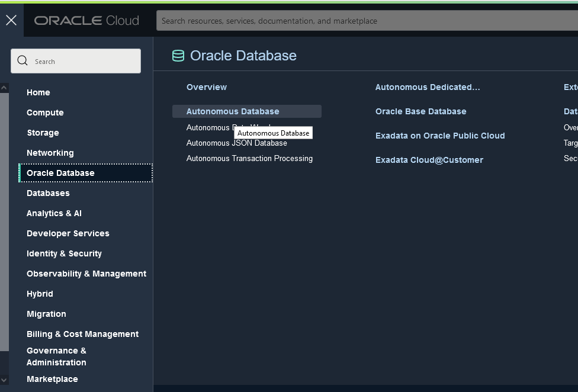
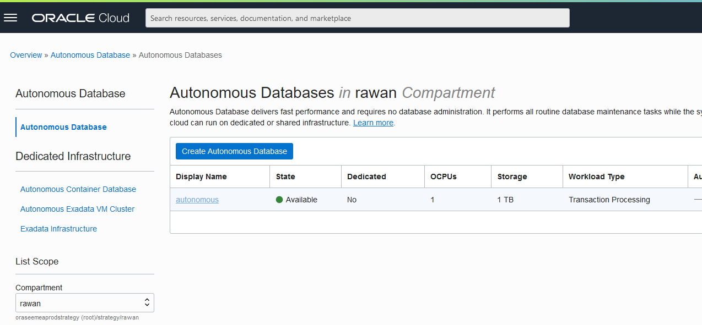
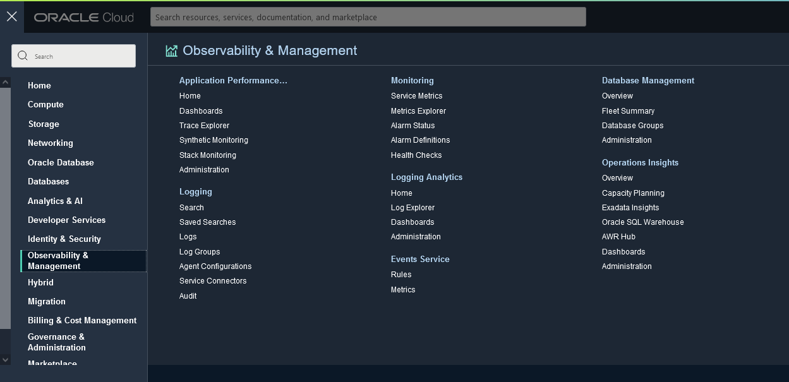

# Database Management & Operation Insights

## Introduction

 Database Management Cloud Service, DBAs get a unified console for on-premises and cloud databases with lifecycle database management capabilities for monitoring, performance management, tuning, and administration. Use advanced database fleet diagnostics and tuning to troubleshoot issues and optimize performance. 
 While Operations Insights is an OCI native service that provides holistic insight into database and host resource utilization and capacity. It also provides direct access to the Oracle Cloud Infrastructure Database Management service, which lets you take advantage of its real-time database performance and management capability with a single click.

Estimated Time: X minutes

### Objectives

In this lab, you will:
- Explore Database Management andn Operations Insights functionality

## Task 1: Enable DataBase Management & Operation Insights
- Go to the Menu select Oracle Database > Autonomous DataBase
  

- As you can see the Database instance has been created with the terraform apply job, click on the DB instance,
  

- At the Associated Features click Enable for both Database Management & Operations Insights

## Task 2: View the Fleet Summary and Capacity Palnning 

- From the Menu go back to the Observability & Management > Database Management

- You can see on the Fleet summary different information related to the the Database instance

 
- You can see further information related tou planning capacity from the realted features > Operations Insights
  
  
 
 With Operations Insights you can:

  - Analyze resource usage of databases/hosts across the enterprise
  - Forecast future demand for resources based on historical trends
  - Compare SQL Performance across databases and identify common patterns
  - Identify SQL performance trends across enterprise-wide databases
  - Analyze AWR statistics for database performance, diagnostics, and tuning across a fleet of databases

 You can now move to **[next lab!](../monitor/monitor.md)**
## **Acknowledgements**
  - **Author** - Rawan Aboukoura - Technology Product Strategy Manager, Victor Martin - Technology Product Strategy Manager 
  - **Contributors** -
  - **Last Updated By/Date** -

