# Logging Analytics & Logging

## Introduction

In this lab we will unleash the capabilites of Logging Analytics and review aggregated data in a dashboard and explore the available logs in the Log Explorer. 

Estimated Time: X minutes

### Objectives

In this lab, you will:
-	explore the Log Explorer and diffrent visualization capabilites.
- create dashboard.


### Prerequisites

- complete lab 1.
  
## Task 1: Verify OKE Running and Generate Error Logs 

  - With the **_KUBECONFIG_** exported you can use **_kubectl_** to get some information

   Kubernetes Nodes:
    ```
    <copy>
      kubectl get nodes
    </copy>
    ```
  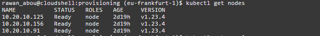
    Kubernetes services:

    ```
    <copy>
      kubectl get services
    </copy>
    ```  
  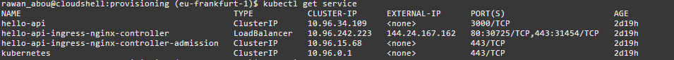
    You can also list the helm app installed with:
    ```
    <copy>
      helm list
    </copy>
    ```
  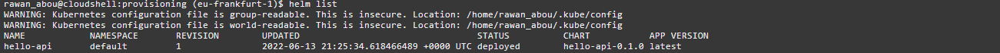
  Make sure the application hello-api is successfully deployed.

  - Get the public IP of the load balancer into the variable **`LB_PUBLIC_IP`**
  
    ```
    <copy>
    export LB_PUBLIC_IP=$(kubectl get services -o jsonpath='{.items[?(@.spec.type=="LoadBalancer")].status.loadBalancer.ingress[0].ip}')
    </copy>
    ```
    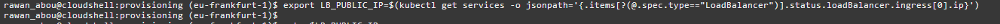
  - Print the IP, it should return a valid public IP address.
    ```
    <copy>
      echo $LB_PUBLIC_IP
    </copy>
    ```
  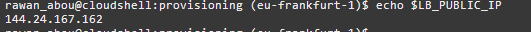
  - You are going to generate some workload and therefore logs to be explored with Logging Analytics. We are using a tool called k6.oi run in a container locally.
    ```
    <copy>
      docker run -i grafana/k6 run -e LB_PUBLIC_IP=$LB_PUBLIC_IP - <../load/test.js
    </copy>
    ```
    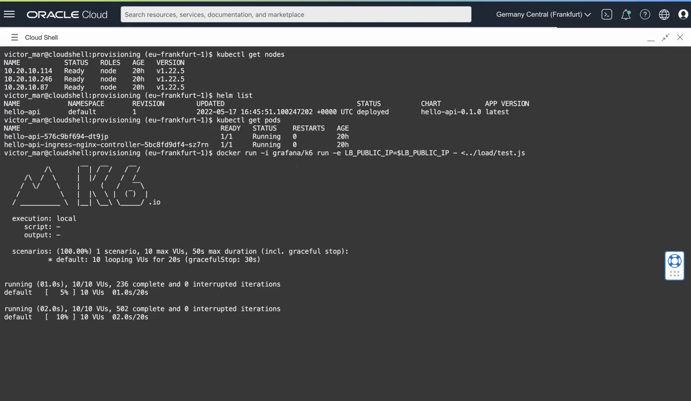

  Finally, generate an error with this curl command on an endpoint that doesn't exist, you can run it for several times to create several logs.

    ```
    <copy>
    curl -s http://$LB_PUBLIC_IP/nofound
    </copy>
    ```
    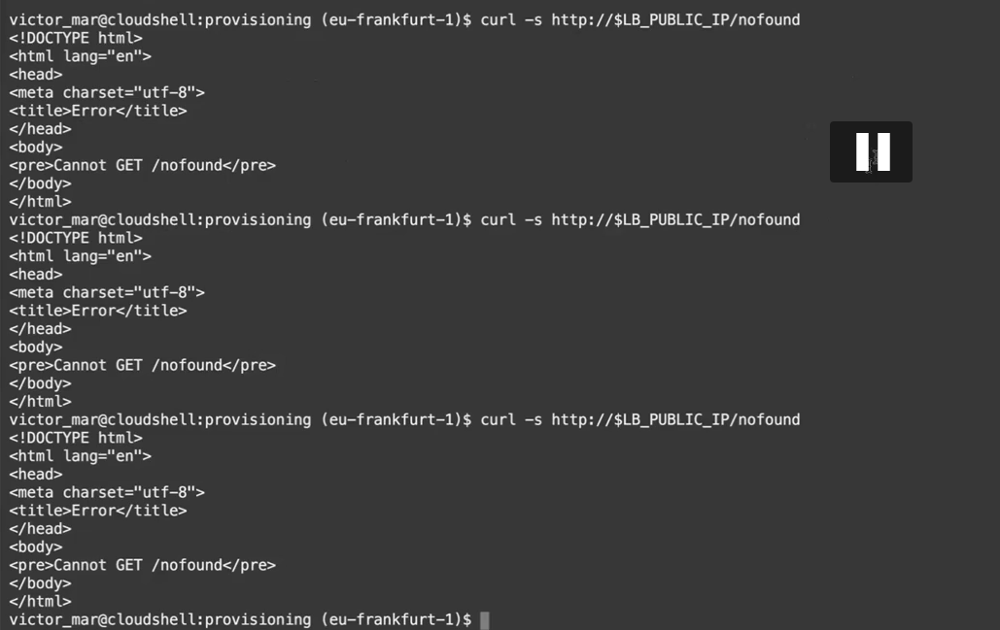
## Task 2: Review the Collected Logs in the Log Explorer 

  - Let's start discover some of the Logging Analytics capabilities, go to **Menu > Observability & Management > Logging Analytics > Log Explorer**

  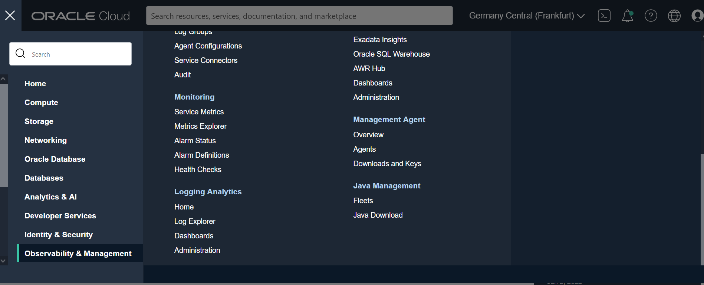

  - You will see that logs has already started to show on the graph
    
    > Make sure you have chose the right comaprtamnet 
   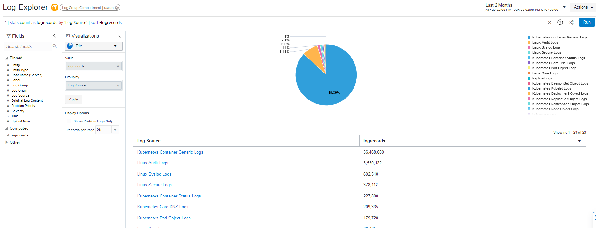


  - To have a deeper view of our application you can filter **Log Source** and choose the one we created in the previous lab **hello-api-source**, where we can find info about the running application
  
  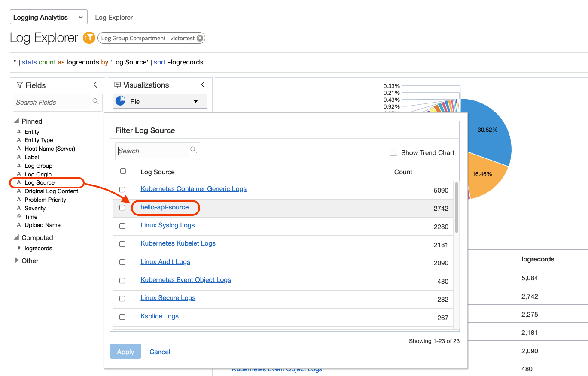

  - As you can see in the query field it shows the **'Log Source' = 'hello-api-source'** but the pie visualisation doesn't show a meaningful data so we can change it by choosing different visualisation.
  
  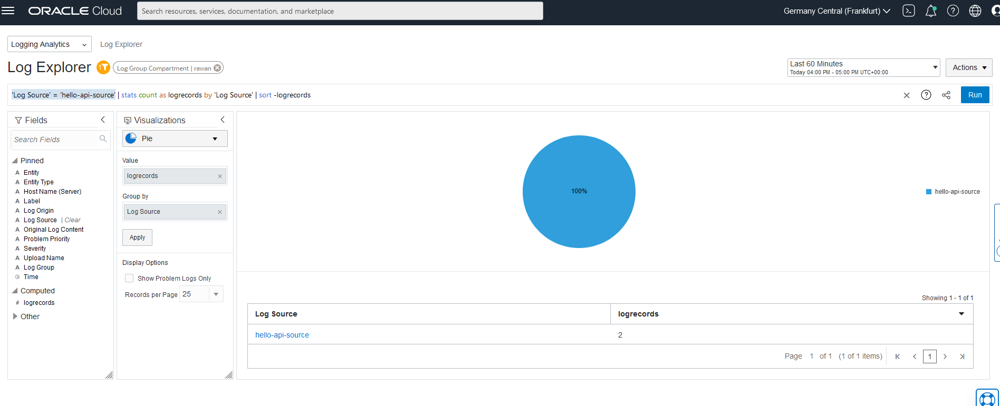

  - Select **Line** as visualization, and to visualize the workload over a longer period of time you can change the duration selected from the top right side.

  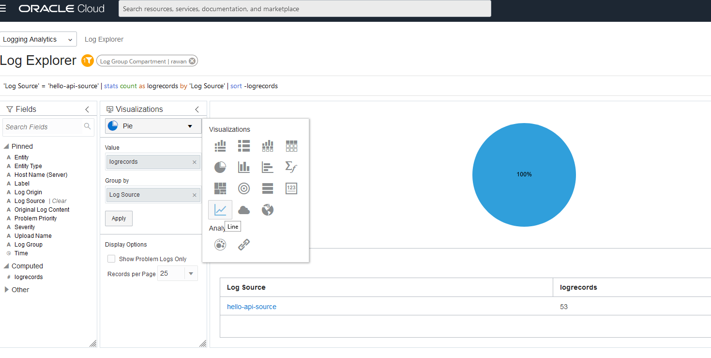
  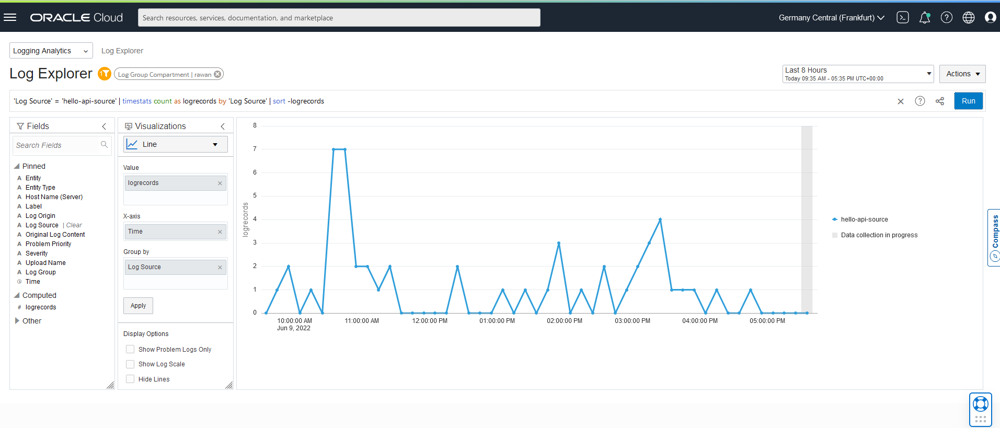
  

 
  - To visualize the log errors 404 genetrated earlier, select **Records and Histograms** as visualization.
  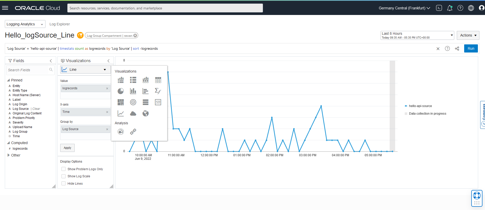

  - At the query field on the top, paste the following query to filter the logs with **404** error and click **Run**:

    ```
    <copy>
    '404' and 'Log Source' = 'hello-api-source' | timestats count as logrecords by 'Log Source' | sort -logrecords
    </copy>
    ```
  - You will see the log errors 404 you generated with the /notfound path.
  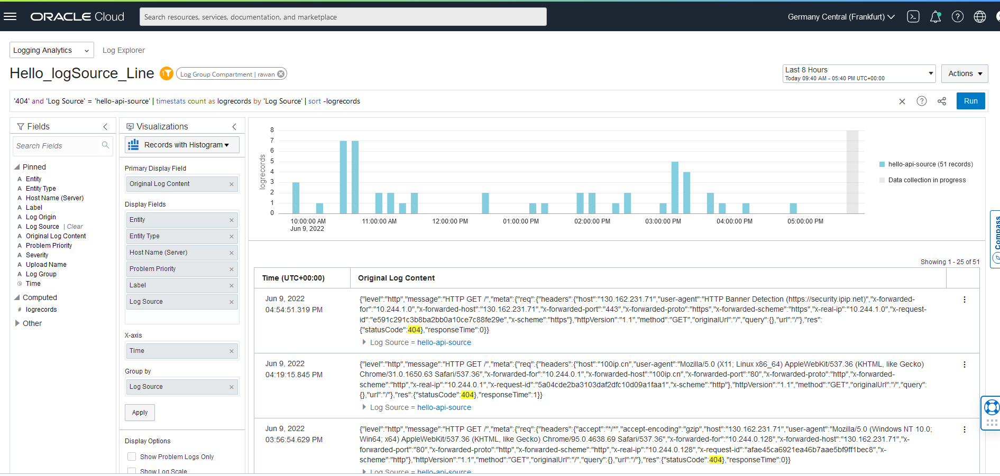


## Task 3: Create Your Own Dashboard

 - To keep an eye on the enviroment we will save some searches that show a summary view of the OKE logs and matrices to a new dashboard that will constantly update the views regarding those specific searches you choose, for this workshop I have chosen to save the following searches:

  ### Number of Nodes:
  - At the query box paste the following:
    ```
    <copy>'Log Source' = 'Kubernetes Node Object Logs' | stats latest('Ready Status') as 'Ready Status' by Node
    </copy>
    ```
  And choose Visualization **Tile**
  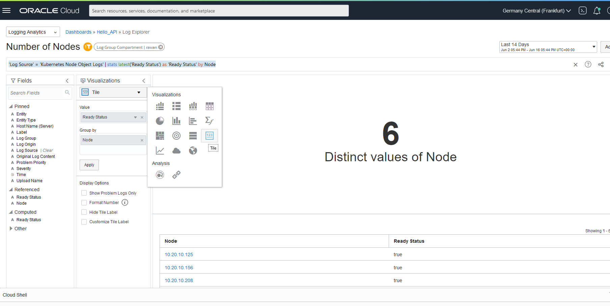
  
 - to create a new dashboard go to the top right side and click  **Action** > **Save as**
  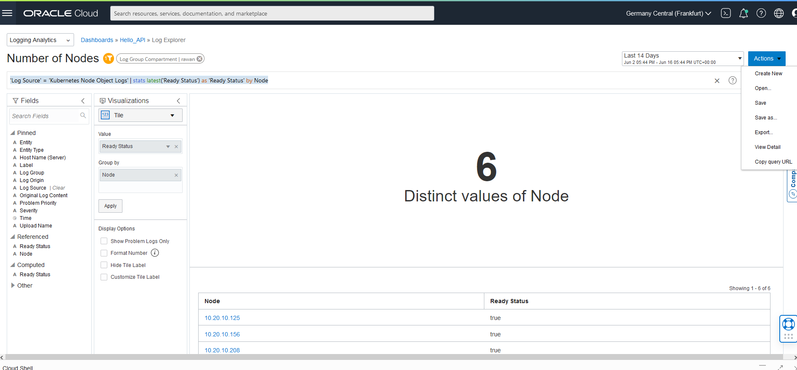

  - Select the right compartment, choose a name for the **Search Name** and click **Add to dashboard** and choose **New Dashboard**, select the same compartment as the Search Name and enter a name for the dashborad in the **Dashboard Name** 
  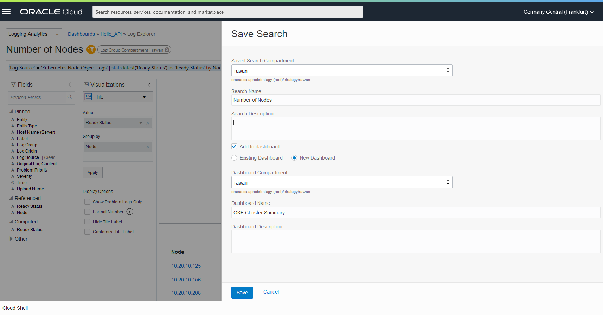


  ### For deployment count: 
  - At the query box paste the following:
    
    ```
    <copy>
    'Log Source' = 'Kubernetes Deployment Object Logs' and 'Available Status' = True | stats distinctcount(Deployment)

    </copy>
    ```
  - Visalization: Tile
  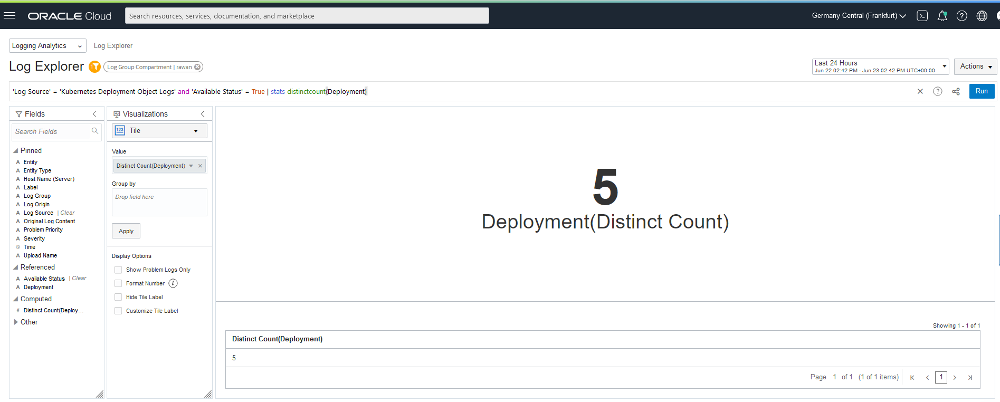
  - Just as shown in the steps earlier, click the **Actions** drill down and select the same compartment and change the **Search Name**, select **Add to dashboard** > **Existing Dashboard** and choose the **Existing Dashboard** you created earlier.lick the **Actions** drill down and select the same compartment and change the **Search Name**, select **Add to dashboard** > **Existing Dashboard** and choose the **Existing Dashboard** you created earlier.
  

  ### Pods Count 
  - At the query box paste the following:

    ```
    <copy>
    * | stats count as logrecords by 'Log Source' | sort -logrecords
    </copy>
    ```
   - Visalization: Tile
   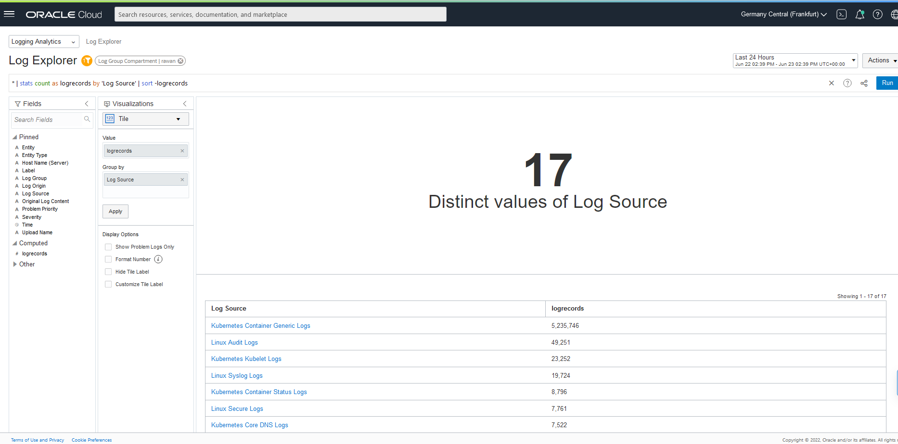
- Just as shown in the steps earlier, click the **Actions** drill down and select the same compartment and change the **Search Name**, select **Add to dashboard** > **Existing Dashboard** and choose the **Existing Dashboard** you created earlier.lick the **Actions** drill down and select the same compartment and change the **Search Name**, select **Add to dashboard** > **Existing Dashboard** and choose the **Existing Dashboard** you created earlier.
  

### Container Status
  - At the query box paste the following:

  ```
  <copy>
    Time > dateRelative(15minute) and 'Log Source' = 'Kubernetes Container Status Logs' | stats distinctcount('Container ID') by Status

  </copy>
  ```
 -  Visualization: Pie
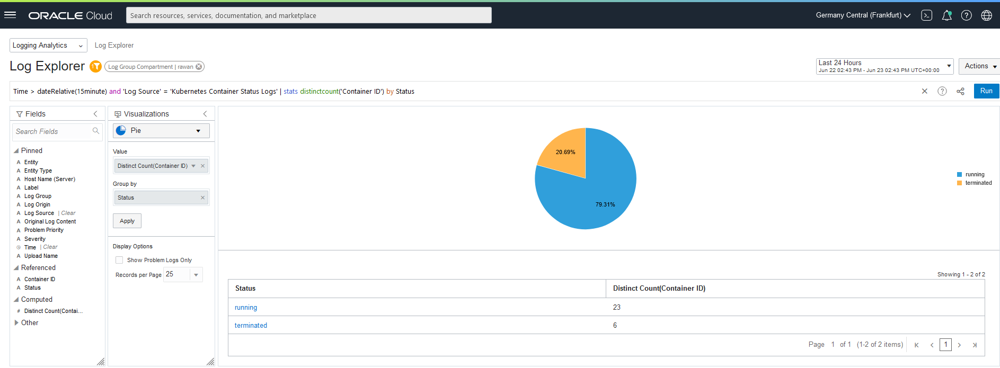
- Just as shown in the steps earlier, click the **Actions** drill down and select the same compartment and change the **Search Name**, select **Add to dashboard** > **Existing Dashboard** and choose the **Existing Dashboard** you created earlier.lick the **Actions** drill down and select the same compartment and change the **Search Name**, select **Add to dashboard** > **Existing Dashboard** and choose the **Existing Dashboard** you created earlier.
  


### Operation System Logs
  - At the query box paste the following:

  ```
  <copy>
  'Log Source' in ('Linux Syslog Logs', 'Linux Secure Logs', 'Linux Cron Logs', 'Linux Mail Delivery Logs', 'Linux YUM Logs', 'Ksplice Logs', 'Linux Audit Logs') | stats count as logrecords by 'Log Source' | sort -logrecords
  </copy>
  ```
 - Visualization: Pie
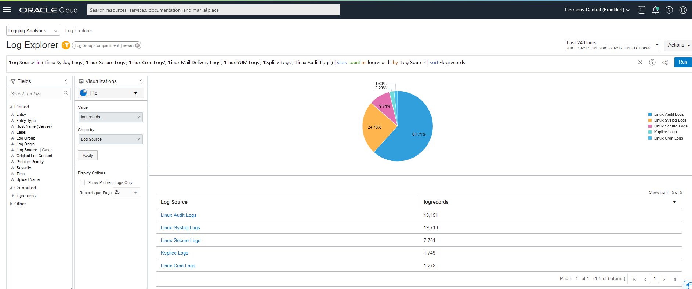
- Just as shown in the steps earlier, click the **Actions** drill down and select the same compartment and change the **Search Name**, select **Add to dashboard** > **Existing Dashboard** and choose the **Existing Dashboard** you created earlier.lick the **Actions** drill down and select the same compartment and change the **Search Name**, select **Add to dashboard** > **Existing Dashboard** and choose the **Existing Dashboard** you created earlier.
  

### Running Pods Per Node
  - At the query box paste the following:

  ```
  <copy>
  'Log Source' = 'Kubernetes Pod Object Logs' and 'Pod Phase' = running | timestats span = 15minute distinctcount(Pod) as 'Pods Running' by Node
  </copy>
  ```
 - Visualization: Line
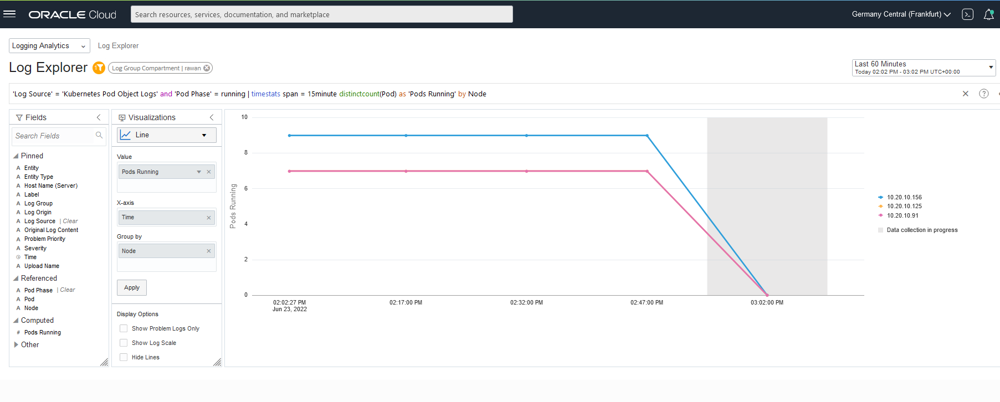
- Just as shown in the steps earlier, click the **Actions** drill down and select the same compartment and change the **Search Name**, select **Add to dashboard** > **Existing Dashboard** and choose the **Existing Dashboard** you created earlier.lick the **Actions** drill down and select the same compartment and change the **Search Name**, select **Add to dashboard** > **Existing Dashboard** and choose the **Existing Dashboard** you created earlier.
  

### OKE system logs trend
  - At the query box paste the following:

    ```
    <copy>
    'Log Source' in ('Kubernetes Kubelet Logs', 'Kubernetes Core DNS Logs', 'OKE Proxymux Client Logs', 'Kubernetes Flannel Logs', 'Kubernetes Proxy Logs', 'Kubernetes CSI Node Driver Logs', 'Kubernetes DNS Autoscaler Logs') | timestats count as 'Log Records' by 'Log Source' 
    </copy>
    ```
- Visualization: Line
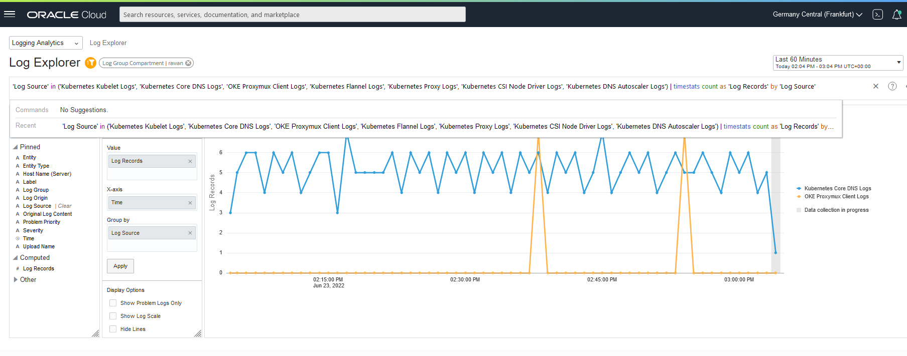
- Just as shown in the steps earlier, click the **Actions** drill down and select the same compartment and change the **Search Name**, select **Add to dashboard** > **Existing Dashboard** and choose the **Existing Dashboard** you created earlier.lick the **Actions** drill down and select the same compartment and change the **Search Name**, select **Add to dashboard** > **Existing Dashboard** and choose the **Existing Dashboard** you created earlier.
  


### Infractructure General Logs Overview
  - Remove the privous searched queries, click run and choose the **Cluster** Visualization, which apply the machine learning capabilities to identify the log records into(clusters, potential issues, outliers,trends)

  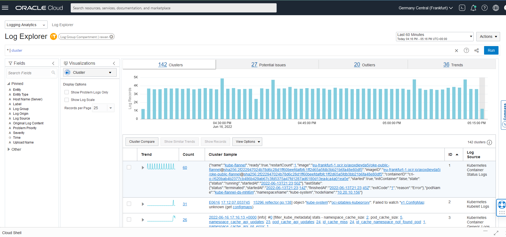
- Just as shown in the steps earlier, click the **Actions** drill down and select the same compartment and change the **Search Name**, select **Add to dashboard** > **Existing Dashboard** and choose the **Existing Dashboard** you created earlier.lick the **Actions** drill down and select the same compartment and change the **Search Name**, select **Add to dashboard** > **Existing Dashboard** and choose the **Existing Dashboard** you created earlier.
  

  -  To view the created dashboard, from the top left side go to **Dashboards**, and select the created dashboard **Hello_API**
  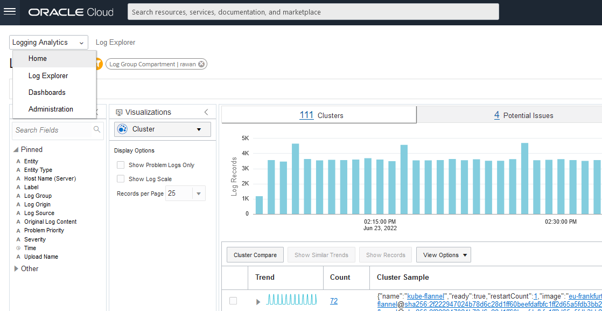
  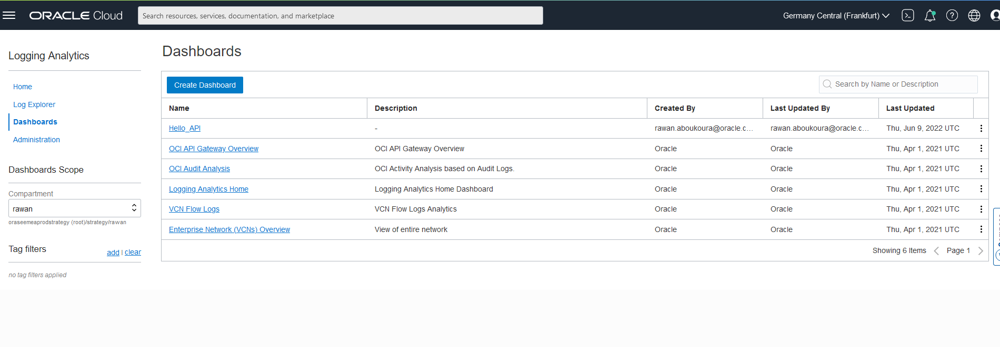

  - Here you can see the saved searches 
  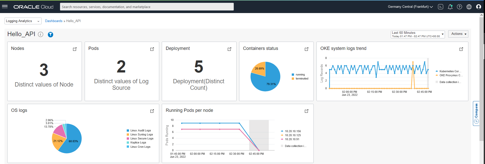

  - To design your costumized dashboard as you prefer by clicking on the **Actions** > **Edit**, you can simply drag and drop the widgets to change their locations and resize them as your preferance 
  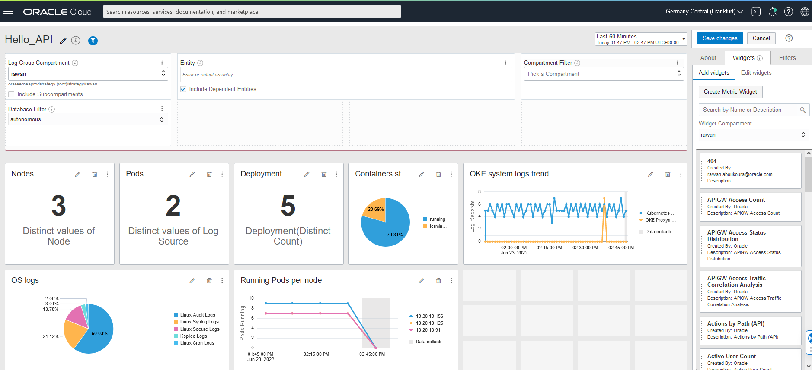
  

## Task 4: Ingest the Logs into Logging (Optional)

- Create a Log Group - This is a logical container for organizing logs, Identity and Access Management (IAM) policies can control who has access to a Log Group.
- Select from the left side menu **Observability & Management > Logging > Log Groups**
 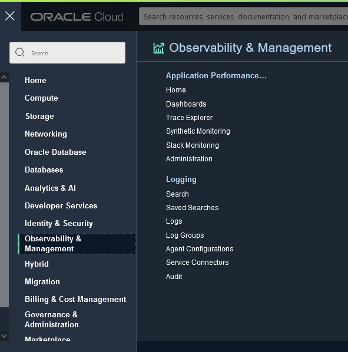

- Click Create **Log Group** 
    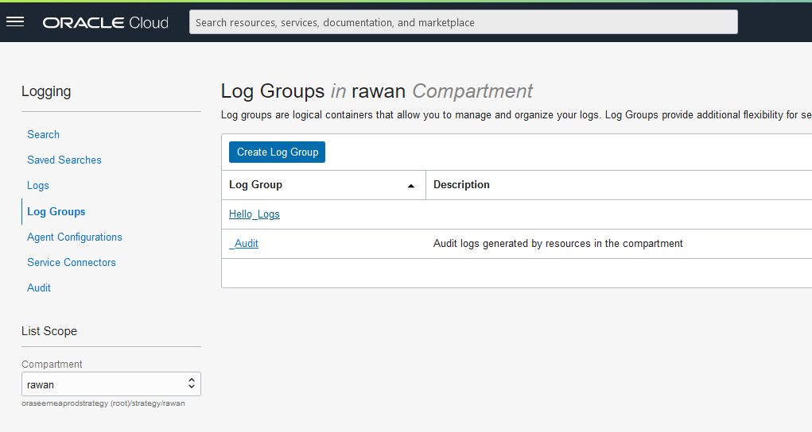
    ```

    Compartment: <SelectCompartment
    Name: <LogGroupName>
    Description:  <LogGroupDescription>

    ```
  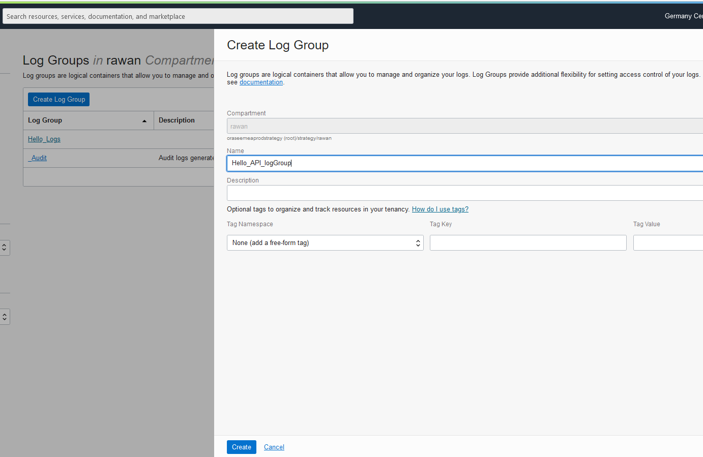

  - Create a Custom Log - The Custom Log will contain all information that is uploaded by the Agent Configuration.
  - Navigate to **Logging -> Logs -> Create Custom Log**
  

  - Enter the following Information, then click Create **Create Custom Logs**
    ```

    Custom Log Name: <CustomLogName>
    Compartment: <SelectCompartment>
    Log Group: <SelectLogGroup>
    Show Additional Option:
    Select Log Retention: 1, 2, 3, 4, 5 or 6 months

    ```
    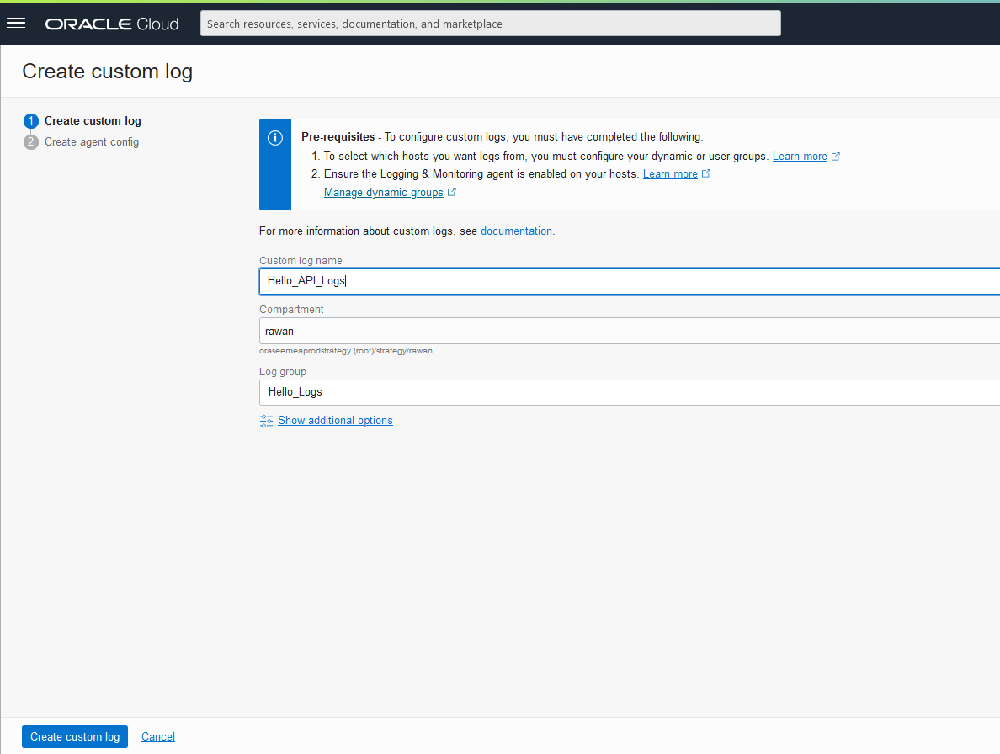
  - To create Agent Configuration enter the following inormation:
    ```
      Configuration Name: <ConfigurationName>
      Compartment: <SelectCompartment>
      Group Type: Dynamic Group
      Group: <SelectDynamicGroup>
      Configure Log Inputs:
          Input Type: Log Path
          Input Name: <InputName>
          File Paths: /var/log/containers/*.log
      Advanced Parser Options:
          Parser: JSON
          Time Format: %Y-%m-%dT%H:%M:%S.%NZ
      Select Log Destination:
          Compartment: <SelectCompartment>
          Log Group: <SelectLogGroup>
          Log Name: <SelectLogName>
    ```
    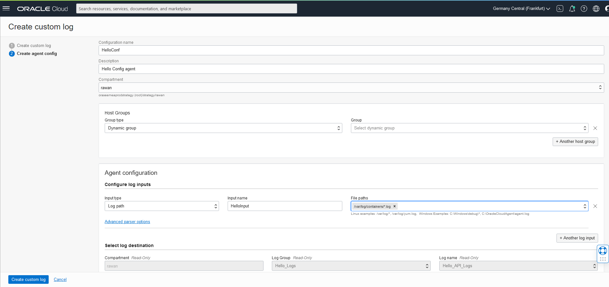
  - Navigate to **Logging > Search**, you will the logs are ingested and you can **Save search** and explore the logs further
    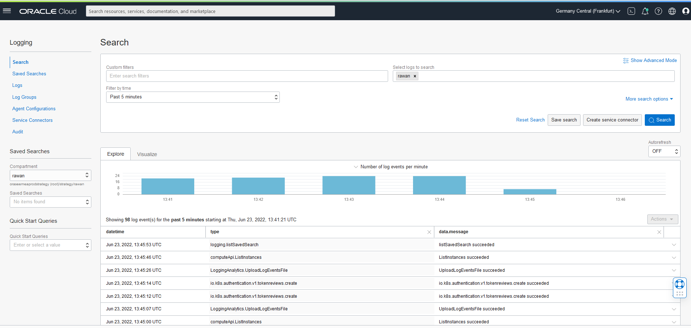
  Well done, you can now proceed to the next lab!

## **Acknowledgements**
  - **Author** - Rawan Aboukoura - Technology Product Strategy Manager, Victor Martin - Technology Product Strategy Manager 
  - **Contributors** -
  - **Last Updated By/Date** -

