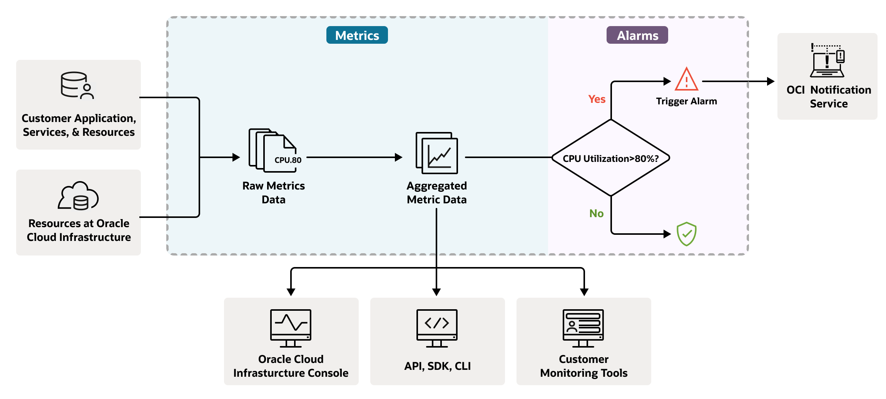
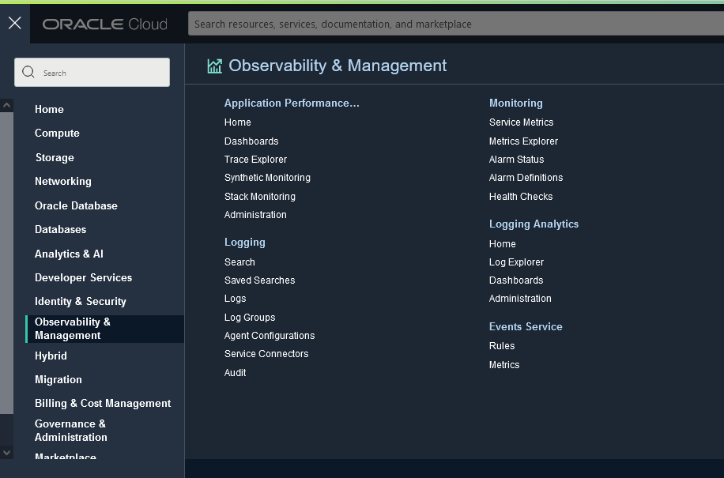
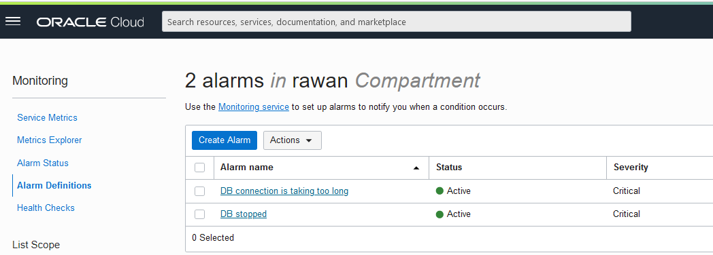
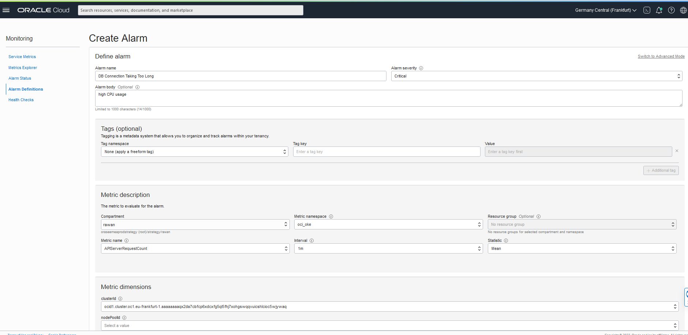
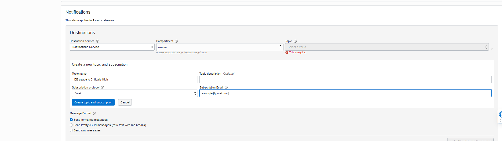

# Monitoring

## Introduction

The Oracle Cloud Infrastructure Monitoring service uses metrics  to monitor resources and alarms  to notify you when these metrics meet alarm-specified triggers. 

Estimated Time: X minutes

### Objectives

In this lab, you will:
- Create an alarm

## Task 1: Create An Alarm 

- Fom the main menu, click **Alarm Definitions**, then click **Create Alarm**
  
  

- Fill in the required information 
 

- enter an email to recieve a notification on 
  

- Finally, click create alarm

You can now proceed to **[next lab.](../simulation/simulation.md)**
## **Acknowledgements**
  - **Author** - Rawan Aboukoura - Technology Product Strategy Manager, Victor Martin - Technology Product Strategy Manager 
  - **Contributors** -
  - **Last Updated By/Date** -
