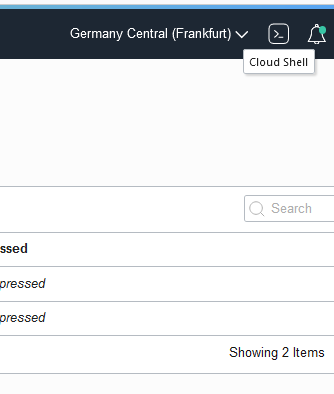
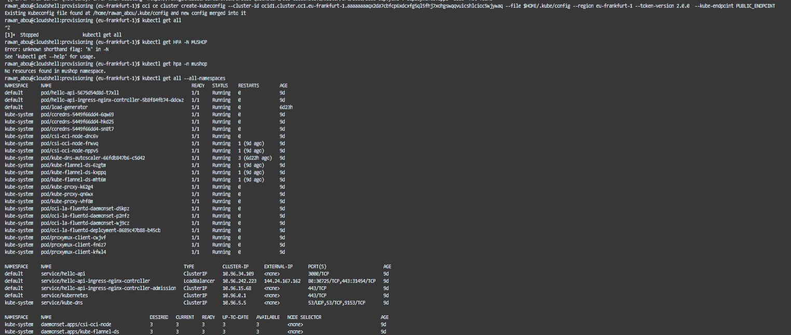
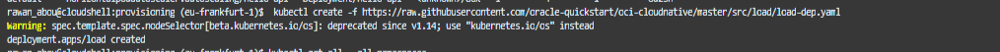
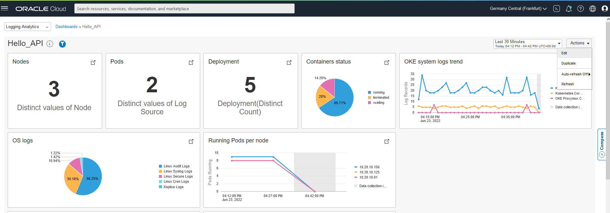
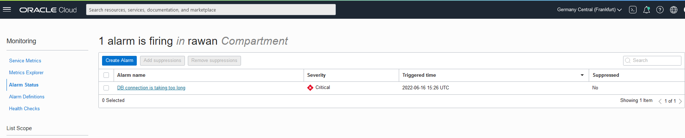
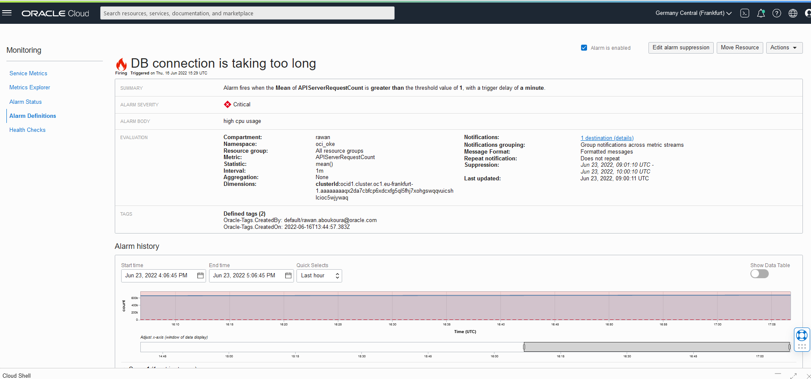
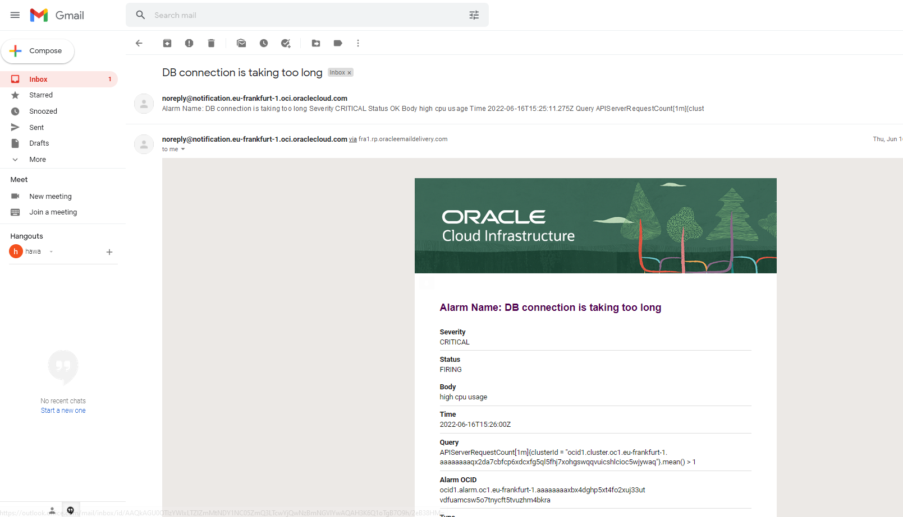
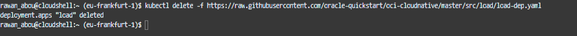

# Outage Simulation

## Introduction

This step showcases the a load file deployed to the application which will create a sudden increase in the API server request and we will see how the alarms firing works and we will notice the change in the dashboards.

Estimated Time: X minutes

### Objectives

In this lab, you will:
- Simulate An Error


## Task 1: Create Load

- Open the Cloud Shell

- Access the OKE cluster 


- Create the load
    ```
    <copy>
    kubectl create -f https://raw.githubusercontent.com/oracle-quickstart/oci-cloudnative/master/src/load/load-dep.yaml

    </copy>
    ```
    

## Task 2: LA Dashboard

- After Some minutes you find changes in the views

    

## Task 3: Check Firing Alarms

- From the Menu select **O&M > Monitoring > Alarm Status**

- You will see the a firing alarm which you can find more information by clicking on it

- Check the email inbox you used creating the alarm to see the notification

- Finally, remove the load created from the Cloud Shell


## **Acknowledgements**
  - **Author** - Rawan Aboukoura - Technology Product Strategy Manager, Victor Martin - Technology Product Strategy Manager 
  - **Contributors** -
  - **Last Updated By/Date** -
